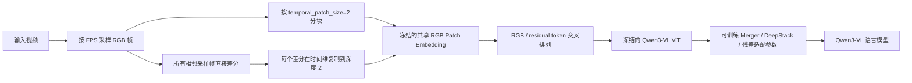

# TimeLoc-motion

TimeLoc-motion 是一个基于 **Qwen3-VL-2B** 的视频时序定位研究项目。当前实现使用残差交叉时序序列（Residual-Interleaved Temporal Tokens, RIT），在 RGB 时序块后插入所有相邻采样帧的独立差分块，以增强模型对事件边界和状态变化的建模能力。

> 当前仓库提供模型、数据处理、两阶段训练与评测代码。所有性能结论均需以服务器端正式实验结果为准。

## 方法概览

按 FPS 采样得到 N 帧 F0,...,F(N−1)。对统一缩放和归一化后的所有相邻帧直接计算 R_i = F_(i+1) − F_i，共 N−1 个独立三通道有符号差分。不额外解码区间内帧，也不跨时间累加差分。

RGB 仍按 temporal_patch_size=2 分为 K=ceil(N/2) 个块。每个差分在时间维复制两次，与 RGB 共用冻结的 Conv3D Patch Embedding。每个 RGB 块后依次放置块内差分和连接下一块的差分（若存在）。例如四帧的序列为：

RGB(F0,F1), R0, R1, RGB(F2,F3), R2。

总视觉块数为 ceil(N/2)+N−1。奇数帧的最后一个 RGB 块复制末帧补齐，但不为补齐帧生成差分。

Prompt 中的文本时间戳使用 RGB block 和 residual block 各自真实时间区间的中点。视觉 token 不再叠加连续时间编码，保留 Qwen3-VL 原有位置编码。



### 参数训练策略

- 冻结 Qwen3-VL ViT 主干及共享 Patch Embedding。
- 训练视觉 Merger、DeepStack、残差适配参数和语言模型参数。
- RGB 与 residual 共同占用 `total_tokens` 指定的总视觉 token budget。
- residual token 同样参与 DeepStack 特征构建。
- 训练和评测必须使用一致的 FPS、token budget 与 residual 配置。

### Prompt 结构

系统会在视频内容前加入如下视觉序列说明：

```text
The visual input is an interleaved sequence of RGB frame blocks and adjacent-frame
residual-motion blocks. Each RGB block contains two sampled frames and is followed
by their within-pair difference and then the difference to the next pair, when available.
Each residual is the later sampled frame minus the immediately preceding sampled frame.
The timestamp before every block is its real temporal midpoint.
```

随后拼接任务指令、按真实区间中点生成的时间戳提示以及对应的监督答案。

## 环境安装

建议在独立 Conda 环境中安装依赖：

```bash
conda create -n timeloc-motion python=3.11 -y
conda activate timeloc-motion

pip install -r requirements.txt
pip install -r requirements_train.txt
```

FlashAttention、CUDA 和 PyTorch 版本需要根据服务器环境匹配安装。

## 两阶段训练

训练采用两个连续阶段，且脚本会自动将 Stage 1 输出权重传递给 Stage 2。

### Stage 1：GEB+

使用 GEB+ 的“给定 boundary timestamp，生成边界前后状态”任务训练残差运动建模相关能力。

### Stage 2：TimeLens 20K

导入 Stage 1 参数，在当前 baseline 的约 20K duration-balanced、纯视觉子集上完成最终训练，不使用音频。

一次性启动两个阶段：

```bash
mkdir -p train_logs

nohup env CUDA_VISIBLE_DEVICES=0,1,2,3,4,5,6,7 \
  bash train_scripts/run_two_stage_rit_qwen3_2b.sh \
  --model_path /path/to/Qwen3-VL-2B-Instruct \
  --gebplus_annotation_path /path/to/gebplus/annotations.json \
  --gebplus_video_root /path/to/gebplus/videos \
  --timelens_data_root /path/to/timelens/data \
  --target_size 20000 \
  --batch_per_device 1 \
  --global_batch_size 128 \
  --num_devices 8 \
  --total_tokens 8192 \
  --fps 1 \
  > train_logs/train_2stage.log 2>&1 &
```

如果 Stage 1 已经完成，可以单独启动 Stage 2：

```bash
mkdir -p train_logs

nohup env CUDA_VISIBLE_DEVICES=0,1,2,3,4,5,6,7 \
  bash train_scripts/run_stage2_rit_qwen3_2b.sh \
  --stage1_model_path /path/to/stage1-gebplus \
  --timelens_data_root /path/to/timelens/data \
  --target_size 20000 \
  --batch_per_device 1 \
  --global_batch_size 128 \
  --num_devices 8 \
  --total_tokens 8192 \
  --fps 1 \
  > train_logs/train_stage2.log 2>&1 &
```

训练脚本支持 `use_liger`，并关闭与当前多模态训练路径不兼容的 fused linear cross entropy。具体参数以脚本内的命令行帮助和当前配置为准。

## 评测

评测程序会根据 checkpoint 配置识别 RIT 模型。FPS、`min_tokens` 和 `total_tokens` 应与训练 checkpoint 保持一致。

```bash
CUDA_VISIBLE_DEVICES=0,1,2,3,4,5,6,7 \
model_path="/path/to/stage2-timelens-20k" \
datasets="charades-timelens" \
min_tokens=64 \
total_tokens=8192 \
FPS=1 \
pred_path="./eval_res/" \
bash scripts/eval_timelens_bench.sh
```

## 关键目录

```text
TimeLoc-motion/
├── training/
│   ├── models/rit_qwen3_vl.py          # RIT 模型与共享 Patch Embedding 路径
│   └── data/residual_video.py           # 相邻采样帧差分与时序构造
├── train_scripts/
│   ├── run_two_stage_rit_qwen3_2b.sh    # GEB+ -> TimeLens 20K 两阶段训练
│   └── run_stage2_rit_qwen3_2b.sh       # Stage 2 独立训练
├── scripts/eval_timelens_bench.sh        # 时序定位评测入口
├── evaluation/                           # 推理与指标计算
└── ideas_docs/
    └── adjacent_sampled_frame_residuals/design.md
```

## 兼容性与实验注意事项

- 当前结构版本为 `shared_rgb_patch_adjacent_v3`。
- 旧版 RIT checkpoint 的序列语义与当前方案不同，加载入口会拒绝旧结构版本。请从原始 Qwen3-VL 权重重新进行两阶段训练。
- 修改 FPS、`temporal_patch_size`、token budget 后，需要同时检查训练和评测预处理。
- 已删除 residual_num_diffs 参数。固定总预算下，新增差分块会降低可用空间分辨率或最大采样帧数；效果需实验验证。
- 本仓库不包含数据集、模型权重、训练输出和正式实验指标。

完整设计说明见 [ideas_docs/adjacent_sampled_frame_residuals/design.md](ideas_docs/adjacent_sampled_frame_residuals/design.md)。

## 致谢

本项目基于 Qwen3-VL、LLaMA-Factory 相关训练组件以及公开视频时序定位研究代码进行开发。感谢相关开源项目与数据集作者。

连续时间编码移除后，旧 checkpoint 中的 time_position_embedding.* 权重不再使用；严格加载旧 state dict 会出现多余键。当前配置将 use_true_midpoint_time_embedding 记录为 false。该变化需要重新进行训练与评测验证。
