# TimeLoc-motion

TimeLoc-motion 是一个基于 **Qwen3-VL-2B** 的视频时序定位研究项目。当前实现使用残差交叉时序序列（Residual-Interleaved Temporal Tokens, RIT），在 RGB 时序块之间插入由相邻区间运动变化构造的残差块，以增强模型对事件边界和状态变化的建模能力。

> 当前仓库提供模型、数据处理、两阶段训练与评测代码。所有性能结论均需以服务器端正式实验结果为准。

## 方法概览

给定视频，首先按照采样帧率 $f$（默认 $1\ \mathrm{FPS}$）提取 RGB 帧，并按照 Qwen3-VL 的 `temporal_patch_size=2` 构造 RGB temporal block。对于每两个相邻 RGB block 之间的真实时间区间，均匀采样 $M+1=5$ 个帧位置，得到四个相邻帧残差：

$$
\Delta_i = I(\tau_{i+1}) - I(\tau_i), \qquad i=0,1,2,3.
$$

四个残差通过累加合并为一个三通道残差块：

$$
R_k = \sum_{i=0}^{3}\Delta_i.
$$

由于上述求和具有 telescoping 性质，当前实现等价于区间端点差：

$$
R_k = I(\tau_4)-I(\tau_0).
$$

残差块在时间维复制为深度 2，与 RGB block 共用 Qwen3-VL 原生 Conv3D Patch Embedding。RGB 与残差 token 按照下式交叉排列：

$$
\mathcal{Z} = [Z_0^{\mathrm{rgb}}, Z_0^{\mathrm{res}}, Z_1^{\mathrm{rgb}}, \ldots, Z_{K-2}^{\mathrm{res}}, Z_{K-1}^{\mathrm{rgb}}].
$$

RGB block 和 residual block 均使用各自真实时间区间的中点进行连续时间编码；Prompt 中的文本时间戳使用相同的中点时间，保证视觉 token、连续时间位置编码和文本时间提示对齐。

```mermaid
flowchart LR
    V["输入视频"] --> S["按 FPS 采样 RGB 帧"]
    S --> B["按 temporal_patch_size=2 分块"]
    B --> RP["冻结的共享 RGB Patch Embedding"]
    B --> G["相邻 RGB block 的时间间隔"]
    G --> U["均匀采样 5 帧"]
    U --> D["计算 4 个有符号相邻帧残差"]
    D --> A["Accumulate 为 1 个三通道残差"]
    A --> C["时间维复制到深度 2"]
    C --> RP
    RP --> I["RGB / residual token 交叉排列"]
    I --> T["真实区间中点连续时间编码"]
    T --> E["冻结的 Qwen3-VL ViT"]
    E --> M["可训练 Merger / DeepStack / 时间适配参数"]
    M --> L["Qwen3-VL 语言模型"]
```



### 参数训练策略

- 冻结 Qwen3-VL ViT 主干及共享 Patch Embedding。
- 训练视觉 Merger、DeepStack、连续时间编码相关参数和语言模型参数。
- RGB 与 residual 共同占用 `total_tokens` 指定的总视觉 token budget。
- residual token 同样参与 DeepStack 特征构建。
- 训练和评测必须使用一致的 FPS、token budget 与 residual 配置。

### Prompt 结构

系统会在视频内容前加入如下视觉序列说明：

```text
The visual input is an interleaved sequence of RGB frame blocks and accumulated
residual-motion blocks, ordered as RGB, residual, RGB, residual, and so on.
Each residual block accumulates uniformly sampled frame differences and describes
the visual change between its adjacent RGB blocks, and the timestamp before every
block is its real temporal midpoint.
```

随后拼接任务指令、按真实区间中点生成的时间戳提示以及对应的监督答案。

## 环境安装

建议在独立 Conda 环境中安装依赖：

```bash
conda create -n timeloc-motion python=3.11 -y
conda activate timeloc-motion

pip install -r requirements.txt
pip install -r requirements_train.txt
```

FlashAttention、CUDA 和 PyTorch 版本需要根据服务器环境匹配安装。

## 两阶段训练

训练采用两个连续阶段，且脚本会自动将 Stage 1 输出权重传递给 Stage 2。

### Stage 1：GEB+

使用 GEB+ 的“给定 boundary timestamp，生成边界前后状态”任务训练残差运动建模相关能力。

### Stage 2：TimeLens 20K

导入 Stage 1 参数，在当前 baseline 的约 20K duration-balanced、纯视觉子集上完成最终训练，不使用音频。

一次性启动两个阶段：

```bash
mkdir -p train_logs

nohup env CUDA_VISIBLE_DEVICES=0,1,2,3,4,5,6,7 \
  bash train_scripts/run_two_stage_rit_qwen3_2b.sh \
  --model_path /path/to/Qwen3-VL-2B-Instruct \
  --gebplus_annotation_path /path/to/gebplus/annotations.json \
  --gebplus_video_root /path/to/gebplus/videos \
  --timelens_data_root /path/to/timelens/data \
  --target_size 20000 \
  --batch_per_device 1 \
  --global_batch_size 128 \
  --num_devices 8 \
  --total_tokens 8192 \
  --fps 1 \
  > train_logs/train_2stage.log 2>&1 &
```

如果 Stage 1 已经完成，可以单独启动 Stage 2：

```bash
mkdir -p train_logs

nohup env CUDA_VISIBLE_DEVICES=0,1,2,3,4,5,6,7 \
  bash train_scripts/run_stage2_rit_qwen3_2b.sh \
  --stage1_model_path /path/to/stage1-gebplus \
  --timelens_data_root /path/to/timelens/data \
  --target_size 20000 \
  --batch_per_device 1 \
  --global_batch_size 128 \
  --num_devices 8 \
  --total_tokens 8192 \
  --fps 1 \
  > train_logs/train_stage2.log 2>&1 &
```

训练脚本支持 `use_liger`，并关闭与当前多模态训练路径不兼容的 fused linear cross entropy。具体参数以脚本内的命令行帮助和当前配置为准。

## 评测

评测程序会根据 checkpoint 配置识别 RIT 模型。FPS、`min_tokens` 和 `total_tokens` 应与训练 checkpoint 保持一致。

```bash
CUDA_VISIBLE_DEVICES=0,1,2,3,4,5,6,7 \
model_path="/path/to/stage2-timelens-20k" \
datasets="charades-timelens" \
min_tokens=64 \
total_tokens=8192 \
FPS=1 \
pred_path="./eval_res/" \
bash scripts/eval_timelens_bench.sh
```

## 关键目录

```text
TimeLoc-motion/
├── training/
│   ├── models/rit_qwen3_vl.py          # RIT 模型与共享 Patch Embedding 路径
│   └── data/residual_video.py           # 残差采样、累加与时序构造
├── train_scripts/
│   ├── run_two_stage_rit_qwen3_2b.sh    # GEB+ -> TimeLens 20K 两阶段训练
│   └── run_stage2_rit_qwen3_2b.sh       # Stage 2 独立训练
├── scripts/eval_timelens_bench.sh        # 时序定位评测入口
├── evaluation/                           # 推理与指标计算
└── ideas_docs/
    └── residual_interleaved_temporal_tokens/design.md
```

## 兼容性与实验注意事项

- 当前结构版本为 `shared_rgb_patch_accumulate_v2`。
- 旧版“独立 residual Patch Embedding”权重与当前共享 Patch Embedding 结构不完全兼容。
- 修改 FPS、`temporal_patch_size`、residual 采样数或 token budget 后，需要同时检查训练和评测预处理。
- 四残差直接求和会退化为区间端点差；是否优于保留多步运动信息，需要通过消融实验验证。
- 本仓库不包含数据集、模型权重、训练输出和正式实验指标。

完整设计说明见 [ideas_docs/residual_interleaved_temporal_tokens/design.md](ideas_docs/residual_interleaved_temporal_tokens/design.md)。

## 致谢

本项目基于 Qwen3-VL、LLaMA-Factory 相关训练组件以及公开视频时序定位研究代码进行开发。感谢相关开源项目与数据集作者。
