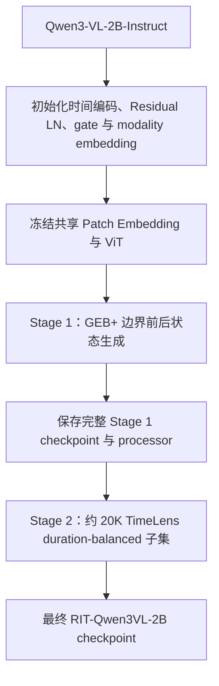

# Residual-Interleaved Temporal Token Qwen3-VL 方案

## 1. 文档状态

- 方案名称：Residual-Interleaved Temporal Token Qwen3-VL
- 简称：RIT-Qwen3VL
- Baseline：Qwen3-VL-2B-Instruct
- 项目：TimeLoc-motion
- 架构版本：`shared_rgb_patch_accumulate_v2`
- 状态：代码已按共享 Patch Embedding 与 residual accumulate 结构更新，尚未进行正式实验验证
- 更新日期：2026-08-05

本文档描述当前确定的模型结构、数据构造、训练策略、推理流程和实验设想。性能收益、显存变化和训练稳定性均为待验证内容。

## 2. 已确认的设计约束

1. RGB 视频按采样 FPS 解码，默认 `fps=1`。
2. 使用 Qwen3-VL ViT 默认 `temporal_patch_size=2`，每两帧组成一个 RGB temporal block。
3. 在相邻 RGB temporal block 之间均匀取 5 个时间点，得到 4 个相邻三通道帧差。
4. 将 4 个帧差逐元素累加为一个三通道 accumulated residual，不再拼接为 12 通道。
5. Residual 不再使用额外 Patch Embedding；将单个 accumulated residual 在时间维复制两次，以适配原始 `temporal_patch_size=2`，并与 RGB 共用同一个 Conv3D Patch Embedding。
6. RGB Patch Embedding、ViT blocks 和原始视觉位置编码在两个训练阶段均冻结。
7. Patch Merger、DeepStack Merger、连续时间编码、residual gate、residual LayerNorm、residual modality embedding 和 LLM 保持可训练；不使用 LoRA。
8. RGB 与 residual 按 `RGB, residual, RGB, residual, ...` 交错，并共同占用 `total_tokens` 视觉 token budget。
9. RGB block 与 residual block 的内部连续时间编码均使用对应真实时间区间的中点；提示词中的文本时间戳也使用同一中点。
10. Prompt 明确提示模型：视觉输入是 RGB 帧块和 accumulated residual 块交错排列的序列。
11. Stage 1 使用 GEB+ 的“给定 boundary timestamp，生成前后状态”任务；Stage 2 加载 Stage 1 完整 checkpoint，在 TimeLens-100K 来源的约 20K duration-balanced visual-only 子集上训练。
12. 不使用音频输入和纯音频证据 query。

## 3. 改进动机

Qwen3-VL 原始视频输入将两帧通过 Conv3D Patch Embedding 合并为一个 temporal block。该表示保留了局部外观与两帧联合信息，但相邻 temporal block 之间没有显式的变化 token。RIT-Qwen3VL 在相邻 RGB block 之间增加 accumulated residual block，使视觉序列显式包含跨 block 的变化信息，并使用真实时间中点对齐模型内部时间编码和文本时间戳。

共享 Patch Embedding 的目标是避免新增一套 residual-specific patchify 网络，让 RGB 与 residual 落入同一个预训练视觉嵌入空间。冻结 ViT 则用于保留 Qwen3-VL 的预训练视觉表征；适配主要由 residual 辅助参数、Merger 和 LLM 完成。

## 4. 符号定义

| 符号 | 含义 |
| --- | --- |
| $f_s$ | 基础 RGB 采样 FPS，默认 1 |
| $\tau$ | ViT temporal patch size，固定为 2 |
| $N$ | 基础采样帧数 |
| $K=\lceil N/\tau\rceil$ | RGB temporal block 数 |
| $L$ | 每个块间区间的 residual 数，默认 4 |
| $p$ | spatial patch size，Qwen3-VL 默认 16 |
| $m$ | spatial merge size，Qwen3-VL 默认 2 |
| $D_v$ | ViT hidden dimension |
| $B_{\mathrm{vis}}$ | RGB 与 residual 合计视觉 token budget |

## 5. 完整模型结构

```mermaid
flowchart LR
    VIDEO["输入视频"] --> RGB["按 FPS 采样 RGB 帧"]
    RGB --> BLOCK["每 2 帧组成 RGB block"]
    BLOCK --> RGBPATCH["冻结的共享 Conv3D Patch Embedding"]

    BLOCK --> GAP["相邻 RGB block 的真实时间间隔"]
    GAP --> SAMPLE["均匀取 5 个时间点"]
    SAMPLE --> DIFF["计算 4 个相邻帧差"]
    DIFF --> ACC["逐元素 accumulate 为 1 个 3 通道 residual"]
    ACC --> DUP["时间维复制为 2 帧"]
    DUP --> RGBPATCH

    RGBPATCH --> MOD["Residual 专用 LN + gate + modality embedding"]
    RGBPATCH --> INTERLEAVE["RGB / residual token 交错"]
    MOD --> INTERLEAVE
    TIME["真实区间中点连续时间编码"] --> INTERLEAVE
    INTERLEAVE --> VIT["冻结的 Qwen3-VL ViT blocks"]
    VIT --> MERGER["可训练 Patch Merger / DeepStack Merger"]
    MERGER --> LLM["可训练 Qwen3 LLM"]
```



图中的共享节点表示 RGB 和 residual 调用同一个 `patch_embed` 实例。Residual 路径在共享 Patch Embedding 后额外经过 residual 专用的轻量参数；RGB 路径不经过这些参数。

### 5.1 RGB 采样与 temporal block

设采样帧及其真实时间戳为：

$$
X_n=V(t_n),\qquad n=0,1,\ldots,N-1.
$$

未触发最大帧数限制时：

$$
t_n=\frac{n}{f_s}.
$$

长视频触发 `fps_max_frames` 时，必须使用视频处理器返回的真实帧索引：

$$
t_n=\frac{\operatorname{frame\_index}_n}{f_{\mathrm{video}}}.
$$

按照 $\tau=2$ 分块：

$$
B_k=[X_{2k},X_{2k+1}],\qquad k=0,1,\ldots,K-1.
$$

最后不足两帧时复制最后一帧，其时间戳也复制最后一帧时间戳。RGB block 的真实中点为：

$$
c_k^{\mathrm{rgb}}=\frac{t_{2k}+t_{2k+1}}{2}.
$$

### 5.2 四个 residual 的均匀采样与 accumulate

对相邻 RGB block $B_k$ 与 $B_{k+1}$，定义块间区间：

$$
I_k^{\mathrm{res}}=[a_k,b_k]
=[t_{2k+1},t_{2k+2}].
$$

在区间内均匀取 $L+1=5$ 个时间点：

$$
u_{k,l}=a_k+\frac{l}{L}(b_k-a_k),
\qquad l=0,1,\ldots,L.
$$

对 resize、rescale、normalize 后的帧计算 4 个相邻差分：

$$
\Delta_{k,l}
=
\widetilde V(u_{k,l+1})-\widetilde V(u_{k,l}),
\qquad l=0,1,\ldots,L-1.
$$

随后在 residual 维上逐元素累加：

$$
A_k
=
\operatorname{Accumulate}_{l=0}^{L-1}\Delta_{k,l}
=
\sum_{l=0}^{L-1}\Delta_{k,l},
$$

$$
A_k\in\mathbb{R}^{3\times H\times W}.
$$

因为采用线性相邻差分与求和，该定义具有望远镜性质：

$$
A_k
=
\widetilde V(b_k)-\widetilde V(a_k).
$$

因此，当前 accumulate 结果在数值上等价于区间端点差，中间三个采样点不会改变最终 $A_k$。这是当前明确设计，不是实现误差；其有效性及与保留四段残差信息的方案之间的差异需要通过消融实验验证。

Residual block 的真实中点为：

$$
c_k^{\mathrm{res}}
=
\frac{a_k+b_k}{2}
=
\frac{t_{2k+1}+t_{2k+2}}{2}.
$$

### 5.3 Residual patch packing

Accumulated residual 按照 Qwen3-VL 相同的 spatial merge 顺序打包。若每个 residual block 有 $P=hw$ 个 spatial patch，则：

$$
Q_k^{\mathrm{res}}
\in
\mathbb{R}^{P\times 3p^2}.
$$

第 $j$ 个 patch 为：

$$
q_{k,j}^{\mathrm{res}}
\in
\mathbb{R}^{3\times p\times p}.
$$

对于 $m=2$，patch 序列在 flatten 前保持以下排列：

$$
[h,w]
\rightarrow
\left[\frac{h}{m},m,\frac{w}{m},m\right]
\rightarrow
\left[\frac{h}{m},\frac{w}{m},m,m\right].
$$

由此保证同一个 $2\times2$ spatial merge window 的四个 patch 连续排列，可直接复用原始 Patch Merger。

### 5.4 复用冻结的 RGB Patch Embedding

Qwen3-VL 原始 Patch Embedding 的输入 temporal depth 为 $\tau=2$。对单个 accumulated residual patch，在时间维无参数复制：

$$
\overline q_{k,j}^{\mathrm{res}}
=
\left[q_{k,j}^{\mathrm{res}},q_{k,j}^{\mathrm{res}}\right]
\in
\mathbb{R}^{3\times2\times p\times p}.
$$

RGB 与 residual 共用同一个冻结的 Conv3D：

$$
u_{k,j}^{\mathrm{rgb}}
=
\operatorname{PatchEmbed}_{\mathrm{shared}}(B_{k,j}),
$$

$$
u_{k,j}^{\mathrm{res}}
=
\operatorname{PatchEmbed}_{\mathrm{shared}}
\left(\overline q_{k,j}^{\mathrm{res}}\right).
$$

其中：

$$
\operatorname{requires\_grad}
\left(\Theta_{\mathrm{PatchEmbed}_{\mathrm{shared}}}\right)
=
\mathrm{False}.
$$

Residual token 再通过小规模可训练适配参数：

$$
z_{k,j}^{\mathrm{res}}
=
\gamma\operatorname{LN}\left(u_{k,j}^{\mathrm{res}}\right)
+e_{\mathrm{res}},
$$

其中 $\gamma$ 是可学习标量，默认初始化为 $0.1$；$e_{\mathrm{res}}\in\mathbb{R}^{D_v}$ 是可学习 modality embedding。当前结构不存在额外 PixelUnshuffle、卷积 residual Patch Embedding 或 12 通道输入投影。

### 5.5 真实中点连续时间编码

对任意 block 的真实中点 $c$，构造正弦特征：

$$
\phi(c)_{2i}=\sin(c\cdot\nu_i),
\qquad
\phi(c)_{2i+1}=\cos(c\cdot\nu_i),
$$

$$
\nu_i=10000^{-2i/D_t}.
$$

再映射到 ViT hidden dimension：

$$
E_t(c)=W_2\operatorname{SiLU}(W_1\phi(c)).
$$

最终 block token 为：

$$
\widehat Z_k^{\mathrm{rgb}}
=
Z_k^{\mathrm{rgb}}+E_t(c_k^{\mathrm{rgb}}),
$$

$$
\widehat Z_k^{\mathrm{res}}
=
Z_k^{\mathrm{res}}+E_t(c_k^{\mathrm{res}}).
$$

时间特征先以 FP32 计算，再转换为时间投影层权重的 dtype，以避免 BF16 模型中的 Linear dtype 不一致；输出在加入视觉 hidden states 前再次对齐 hidden dtype。

### 5.6 Token 交错与视觉编码

交错序列为：

$$
\mathcal Z
=
\left[
\widehat Z_0^{\mathrm{rgb}},
\widehat Z_0^{\mathrm{res}},
\widehat Z_1^{\mathrm{rgb}},
\ldots,
\widehat Z_{K-2}^{\mathrm{res}},
\widehat Z_{K-1}^{\mathrm{rgb}}
\right].
$$

伪时间块总数：

$$
T'=2K-1.
$$

交错后的 token 进入冻结的 Qwen3-VL ViT blocks，随后进入可训练的 Patch Merger 和 DeepStack Merger。模型输出接口仍保持 Qwen3-VL conditional generation 形式。

### 5.7 Prompt 与文本时间戳

训练和评测 Prompt 必须明确说明：

```text
The visual input is an interleaved sequence of RGB frame blocks and accumulated
residual-motion blocks, ordered as RGB, residual, RGB, residual, and so on.
Each residual block accumulates uniformly sampled frame differences and describes the visual
change between its adjacent RGB blocks. The timestamp before every block is its
real temporal midpoint.
```

视觉占位符按交错 block 分段，并在每段前插入同一来源的真实中点：

$$
\langle c_0^{\mathrm{rgb}}\text{ seconds}\rangle,
\langle c_0^{\mathrm{res}}\text{ seconds}\rangle,
\langle c_1^{\mathrm{rgb}}\text{ seconds}\rangle,\ldots
$$

## 6. 总视觉 Token Budget

令每个伪时间块在 Patch Merger 后包含：

$$
P_{\mathrm{merge}}=\frac{hw}{m^2}
$$

个 token，则总 token 数为：

$$
N_{\mathrm{visual}}
=(2K-1)P_{\mathrm{merge}}
\le B_{\mathrm{vis}}.
$$

`total_tokens` 是 RGB 与 residual 的总预算，而不是各自预算。若每个伪时间块至少保留 $b_{\min}$ 个 token：

$$
K_{\max}
=
\left\lfloor
\frac{\left\lfloor B_{\mathrm{vis}}/b_{\min}\right\rfloor+1}{2}
\right\rfloor,
$$

$$
N_{\max}=2K_{\max}.
$$

当 `total_tokens=14336`、`min_tokens=64` 时，默认 $K_{\max}=112$，因此 `fps_max_frames=224`。若命令设置 `total_tokens=8192`，脚本会按相同公式自动得到相应上限。

## 7. 模型输入接口

| 字段 | 形状或类型 | 含义 |
| --- | --- | --- |
| `pixel_values_videos` | 原 Qwen3-VL packed tensor | RGB temporal patches |
| `pixel_values_residuals` | $[N_r,3p^2]$ | accumulated residual patches |
| `rgb_video_grid_thw` | $[N_v,3]$ | 原 RGB grid |
| `residual_grid_thw` | $[N_v,3]$ | residual grid，时间长度为 $K-1$ |
| `video_grid_thw` | $[N_v,3]$ | 交错 grid，时间长度为 $2K-1$ |
| `rgb_temporal_midpoints` | 浮点张量 | RGB block 真实中点 |
| `residual_temporal_midpoints` | 浮点张量 | residual 区间真实中点 |
| `temporal_midpoints` | 浮点张量 | 交错中点；时间编码与文本时间戳的统一来源 |

## 8. 参数冻结与两阶段训练

### 8.1 参数范围

冻结参数集合：

$$
\Theta_{\mathrm{frozen}}
=
\{\Theta_{\mathrm{RGBPatch}},
\Theta_{\mathrm{ViTBlocks}},
\Theta_{\mathrm{VisionPos}}\}.
$$

可训练参数集合：

$$
\Theta_{\mathrm{train}}
=
\{\Theta_{\mathrm{LLM}},
\Theta_{\mathrm{Merger}},
\Theta_{\mathrm{DeepStackMerger}},
\Theta_{\mathrm{Time}},
\Theta_{\mathrm{ResidualNorm}},
\gamma,e_{\mathrm{res}}\}.
$$

两个阶段均使用：

```text
freeze_vision_tower = True
freeze_llm = False
freeze_merger = False
lora_enable = False
```

训练入口会检查视觉侧可训练参数白名单；若 Patch Embedding 或 ViT block 意外解冻则直接报错。

### 8.2 两阶段流程



Stage 1 的监督目标为：

```text
Status_Before: <status immediately before the boundary>
Status_After: <status immediately after the boundary>
```

其语言建模损失为：

$$
\mathcal L_{\mathrm{GEB}}
=
-\frac{1}{M_1}\sum_{i=1}^{M_1}
\log p_\Theta
\left(y_i^{\mathrm{status}}\mid V,t_b,s,y_{<i}\right).
$$

Stage 2 加载 Stage 1 完整 checkpoint，并使用约 20K TimeLens-100K duration-balanced visual-only 子集。过滤纯音频证据 query，目标输出为：

```text
The event happens in <start time> - <end time> seconds.
```

对应损失：

$$
\mathcal L_{\mathrm{TL}}
=
-\frac{1}{M_2}\sum_{i=1}^{M_2}
\log p_\Theta
\left(y_i^{\mathrm{time}}\mid V,q,y_{<i}\right).
$$

### 8.3 建议初始配置

| 参数 | Stage 1 | Stage 2 |
| --- | ---: | ---: |
| 数据 | GEB+ | TimeLens 约 20K 子集 |
| `fps` | 1 | 1 |
| `residual_num_diffs` | 4 | 4 |
| Epoch | 1 | 1 |
| 通用参数 LR | $1\times10^{-5}$ | $1\times10^{-5}$ |
| Residual/时间参数 LR | $1\times10^{-4}$ | $1\times10^{-5}$ |
| Weight decay | 0.1 | 0.1 |
| Warmup ratio | 0.03 | 0.03 |
| Precision | BF16 | BF16 |
| DeepSpeed | ZeRO-3 | ZeRO-3 |
| Seed | 42 | 42 |

这些数值仅是实验起点，不是已验证最优配置。

## 9. 一次性训练与推理流程

训练脚本：

```text
train_scripts/run_two_stage_rit_qwen3_2b.sh
```

脚本顺序执行 Stage 1 和 Stage 2。Stage 2 的 `model_name_or_path` 指向 Stage 1 输出目录；Stage 1 未生成完整 checkpoint 时不会启动 Stage 2。脚本保留 Stage 1 checkpoint，不负责正式评测。

推理和评测必须复用训练时相同的数据路径：

1. 按 FPS 采样 RGB 帧并保留真实帧索引。
2. 每两帧构造 RGB block。
3. 在块间区间均匀取 5 个时间点并计算 4 个相邻帧差。
4. 对 4 个帧差求和，得到一个三通道 accumulated residual。
5. 复制 residual 的时间维并调用共享 Patch Embedding。
6. 使用相同总 token budget、真实中点、交错占位符和提示词。
7. 通过自定义 RIT 模型类生成结果。

## 10. 与 Baseline 的区别

| 项目 | Qwen3-VL-2B baseline | RIT-Qwen3VL-2B |
| --- | --- | --- |
| RGB temporal block | 每 2 帧 | 保持不变 |
| 块间动态信息 | 无显式 token | 4 个帧差累加成 1 个 residual block |
| Residual 通道数 | 无 | 3 |
| Patch Embedding | 原始 Conv3D | RGB 与 residual 共用同一个冻结 Conv3D |
| 时间序列 | 仅 RGB | RGB / residual 交错 |
| 时间编码 | 原始视觉位置机制 | 增加真实中点连续时间编码 |
| 文本提示 | 普通视频 | 明确说明交错序列与 accumulated residual |
| 总视觉预算 | RGB-only budget | RGB + residual 共用同一 budget |
| ViT 训练 | 依 baseline 配置 | Patch Embedding 与 ViT blocks 冻结 |
| Stage 1 | 无 | GEB+ 状态变化 curriculum |
| Stage 2 | 约 20K TimeLens | 加载 Stage 1 后训练相同规模子集 |

## 11. 复杂度与兼容性

交错后的伪时间块数从 $K$ 增加为 $2K-1$。固定总视觉 token budget 时，动态空间分辨率会相应降低，因此实际显存和吞吐需要服务器实验确认。额外开销主要来自块间帧解码、residual 构造、更多伪时间块经过 ViT 和 DeepStack，而不是新增 Patch Embedding 参数。

新结构只新增连续时间 MLP、Residual LayerNorm、标量 gate 和 modality embedding；共享 Patch Embedding 不新增权重且保持冻结。

Config 至少保存：

```text
use_residual_tokens
rit_architecture_version=shared_rgb_patch_accumulate_v2
residual_num_diffs
residual_in_channels=3
residual_gate_init
time_embedding_dim
use_true_midpoint_time_embedding
combined_visual_token_budget
minimum_tokens_per_block
rit_sampling_fps
rit_fps_max_frames
```

采用旧 residual-specific Patch Embedding 的 checkpoint 与当前架构不兼容，必须从官方 Qwen3-VL checkpoint 重新执行 Stage 1。Stage 1 与 Stage 2 之间则要求结构和关键 residual 配置完全一致。

## 12. 需要验证的核心假设

1. Accumulated residual token 能否补充 RGB appearance token 中缺少的块间变化信息。
2. 在线性求和等价于端点差的前提下，保留 4 次密集采样是否仍有必要。
3. 共享且冻结的 RGB Patch Embedding 能否合理编码带正负值的 normalized residual。
4. Residual gate、modality embedding、Merger 和 LLM 是否足以完成模态适配，而无需训练 ViT。
5. GEB+ Stage 1 是否能促使模型实际利用 residual，而不是仅依赖语言先验。
6. 固定总视觉 token budget 下，动态信息收益能否抵消空间分辨率下降。
7. 真实区间中点连续时间编码是否优于仅使用文本时间戳或交错序号。

## 13. 消融实验设计

### 13.1 Residual 表示

| 设置 | 构造 | 通道数 | 目的 |
| --- | --- | ---: | --- |
| R0 | 无 residual | 0 | Baseline |
| R1 | 单个端点差 | 3 | 验证最简变化表示 |
| R2 | 4 个相邻差分直接求和 | 3 | 当前默认方案 |
| R3 | 4 个相邻差分取绝对值后求和 | 3 | 避免正负运动抵消 |
| R4 | 4 个相邻差分沿通道拼接 | 12 | 验证保留分段信息的价值 |

R2 与 R1 数学等价，实验结果原则上应一致；保留两项用于验证数据实现和采样边界是否完全一致。

### 13.2 训练与结构

| 设置 | GEB+ Stage 1 | ViT | Patch Embedding | 目的 |
| --- | --- | --- | --- | --- |
| S0 | 否 | 冻结 | 共享且冻结 | 无 curriculum |
| S1 | 是 | 冻结 | 共享且冻结 | 当前默认方案 |
| S2 | 是 | 解冻 | 共享且训练 | 验证视觉适配上限，非默认 |

### 13.3 时间与预算

| 设置 | 内部时间编码 | 文本时间戳 | 总预算 |
| --- | --- | --- | ---: |
| T0 | 无 | 真实中点 | 14336 |
| T1 | 交错序号 | 真实中点 | 14336 |
| T2 | 真实中点 | 真实中点 | 14336 |
| B2 | 真实中点 | 真实中点 | 8192 |

## 14. 最低限度检查

正式训练由用户在服务器执行。启动前至少检查：

1. 每个视频的 RGB、residual、交错 block 数分别为 $K$、$K-1$、$2K-1$。
2. 每个 residual 区间产生 4 个差分，并在差分维求和为 `[3,H,W]`。
3. Packed residual 宽度为 $3p^2$，而不是 $12p^2$。
4. 模型中不存在 `residual_patch_embed`，RGB 与 residual 调用同一 `patch_embed`。
5. Patch Embedding、ViT blocks 和视觉位置参数均 `requires_grad=False`。
6. Merger、DeepStack Merger、时间编码、Residual LayerNorm/gate/modality embedding 和 LLM 可训练。
7. 交错 feature 数与 `<|video_pad|>` 数完全一致。
8. 时间编码和文本时间戳读取同一个 `temporal_midpoints` 张量。
9. BF16 下连续时间编码输入与投影权重 dtype 一致。
10. Stage 1 checkpoint 能无 missing key 加载到 Stage 2。
11. 训练与评测使用完全相同的 accumulate、共享 Patch Embedding 和 Prompt 逻辑。

以上检查只验证实现一致性，不代表模型效果已经验证。
